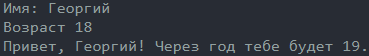
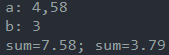
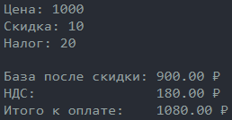
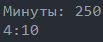
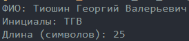
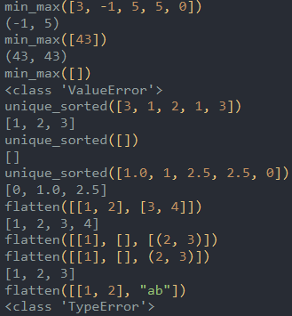
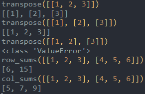
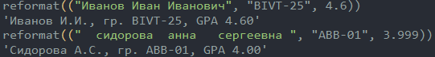

# python_labs

## Лабораторная 1

### Задание 1 (greeting)
```python
print('Привет,', input('Имя: ') + '!', 'Через год тебе будет', str(int(input('Возраст '))+1) + '.')
```


### Задание 2 (sum_avg)
```python
a = float(input('a: ').replace(',','.'))
b = float(input('b: ').replace(',','.'))
print('sum=' + '{:.2f}'.format(a+b) + ';', 'sum=' + '{:.2f}'.format((a+b)/2))
```


### Задание 3 (discount_vat)
```python
price = float(input('Цена: '))
discount = float(input('Скидка: '))
vat = float(input('Налог: '))

base = price * (1 - discount/100)
vat_amount = base * (vat/100)
total = base + vat_amount

print()
print('База после скидки:', '{:.2f}'.format(base), '₽')
print('НДС:              ', '{:.2f}'.format(vat_amount), '₽')
print('Итого к оплате:   ', '{:.2f}'.format(total), '₽')
```


### Задание 4 (minutes_to_hhmm)
```python
minutes = int(input('Минуты: '))
print(str(minutes//60) + ':' + str(minutes - minutes//60*60))
```


### Задание 5 (initials_and_len)
```python
name = input('ФИО: ').split()
print('Инициалы:', name[0][0] + name[1][0] + name[2][0])
print('Длина (символов):', (len(name[0] + name[1] + name[2])+2))
```


## Лабораторная 2

### Задание 1 (arrays)
```pyhton
def min_max(orig):
    if orig == []: return ValueError
    else: return tuple([min(orig), max(orig)])
    
def unique_sorted(orig):
    return sorted(list(set(orig)))

def flatten(orig):
    out = []
    for i in orig:
        if type(i) in [list,tuple]: 
            if i != []:
                for j in i: out.append(j)
        else: return TypeError
    return out
```


### Задание 2 (matrix)
```pyhton
def checkmatrix(matrix):
    for i in matrix:
        if len(i) != len(matrix[0]): return True

def transpose(orig):
    if orig == []: return []
    if checkmatrix(orig): return ValueError
    return [[orig[j][i] for j in range(len(orig))] for i in range(len(orig[0]))]

def row_sums(orig):
    if checkmatrix(orig): return ValueError
    return [sum(i) for i in orig]

def col_sums(orig):
    return [sum(i) for i in transpose(orig)]
```


### Задание 3 (tuples)
```pyhton
def reformat(orig):
    if type(orig[0]) != str: return ValueError
    if type(orig[1]) != str: return ValueError
    if type(orig[2]) != float: return ValueError
    name, group, gpa = orig[0].split(), orig[1], '{:.2f}'.format(round(orig[2], 2))
    if len(name) == 3: name = name[0][0].upper() + name[0][1:] + ' ' + name[1][0].upper() + '.' + name[2][0].upper() + '.'
    else: name = name[0][0].upper() + name[0][1:] + ' ' + name[1][0].upper() + '.'
    return name + ', ' + 'гр. ' + group + ', ' + 'GPA ' + gpa
```
